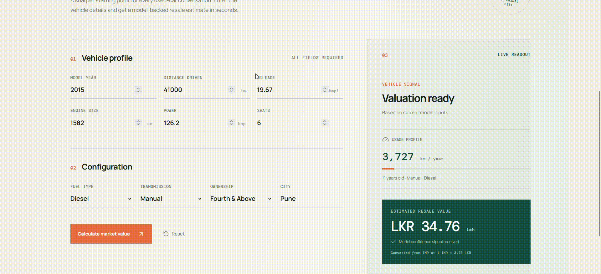

# DriveValue Used Car Price Prediction

DriveValue is a full-stack used-car appraisal application. It combines a
scikit-learn regression pipeline with a FastAPI service and a React interface
so dealership staff can estimate a vehicle's resale price from its
specifications.

## Demo

<p align="center">
  
</p>

The demo shows the appraisal form, API-backed prediction flow, and returned
price estimate.

## What is included

- Data cleaning and profiling for the Used Cars Price Prediction dataset
- Deterministic feature engineering for vehicle age, mileage, power, ownership,
	and age-mileage interaction
- A Gradient Boosting regression pipeline trained on a log-transformed target
- FastAPI endpoints for health checks and price predictions
- A Vite + React frontend for entering vehicle details and viewing estimates

## Quick start

### 1. Install Python dependencies

Create and activate a virtual environment, then install the project requirements:

```bash
python -m venv .venv
```

On Windows PowerShell:

```powershell
.\.venv\Scripts\Activate.ps1
pip install -r requirements.txt
```

On macOS or Linux:

```bash
source .venv/bin/activate
pip install -r requirements.txt
```

### 2. Prepare the model

The repository contains the current model artifacts in `models/`. To rebuild
them from the raw training data, first follow the dataset instructions below,
then run:

```bash
python -m src.train_model
```

### 3. Start the application

Start the API from the repository root:

```bash
python -m uvicorn api.main:app --reload
```

In a second terminal, install the frontend dependencies and start Vite:

```bash
cd frontend
npm install
npm run dev
```

Open <http://localhost:5173>. The frontend proxies prediction requests to the
FastAPI service at <http://localhost:8000>.

## API

The backend exposes:

- `GET /health` - confirms that the API and model are available
- `POST /predict` - returns an estimated price in lakhs

Example request:

```json
{
	"year": 2018,
	"kilometers_driven": 42000,
	"fuel_type": "Petrol",
	"transmission": "Automatic",
	"owner_type": "First",
	"mileage": 18.5,
	"engine": 1197,
	"power": 81.8,
	"seats": 5,
	"location": "Mumbai"
}
```

Interactive API documentation is available at
<http://localhost:8000/docs> when the backend is running.

## Dataset

The data is the Kaggle **Used Cars Price Prediction** dataset by Avi Kasliwal:
<https://www.kaggle.com/datasets/avikasliwal/used-cars-price-prediction>.
Raw CSV files are intentionally ignored by Git. Download them with:

```python
import kagglehub
path = kagglehub.dataset_download("avikasliwal/used-cars-price-prediction")
```

Copy `train-data.csv` and `test-data.csv` from the returned directory to
`data/raw/`, then run:

```bash
python -m src.data_preprocessing
```

The cleaner writes `data/processed/train-clean.csv`,
`data/processed/test-clean.csv`, and `data/processed/data_profile.json`.
Detailed dataset documentation and the observed quality audit are in
[`docs/dataset_report.md`](docs/dataset_report.md).

## Feature engineering

Apply the deterministic feature pipeline to a cleaned dataframe with
`src.feature_engineering.add_features()`:

```python
import pandas as pd

from src.feature_engineering import add_features

train = add_features(pd.read_csv("data/processed/train-clean.csv"))
test = add_features(pd.read_csv("data/processed/test-clean.csv"))
```

The pipeline adds these five features:

- `vehicle_age`
- `mileage_per_year`
- `power_per_cc`
- `owner_rank`
- `age_mileage_interaction`

## Tests

Run the complete Python test suite with:

```bash
python -m pytest tests -q
```

Run the focused feature-engineering tests with:

```bash
python -m pytest tests/test_feature_engineering.py -q
```

## Project layout

```text
api/            FastAPI application, schemas, and prediction service
data/           raw and processed datasets plus profiling output
docs/           dataset, EDA, feature engineering, and architecture reports
frontend/       Vite + React appraisal interface
models/         serialized model pipeline and metadata
notebooks/      exploratory analysis and model training notebooks
public/         static assets, including the application demo GIF
src/            preprocessing, feature engineering, and model training code
tests/          automated API and data-pipeline tests
```
