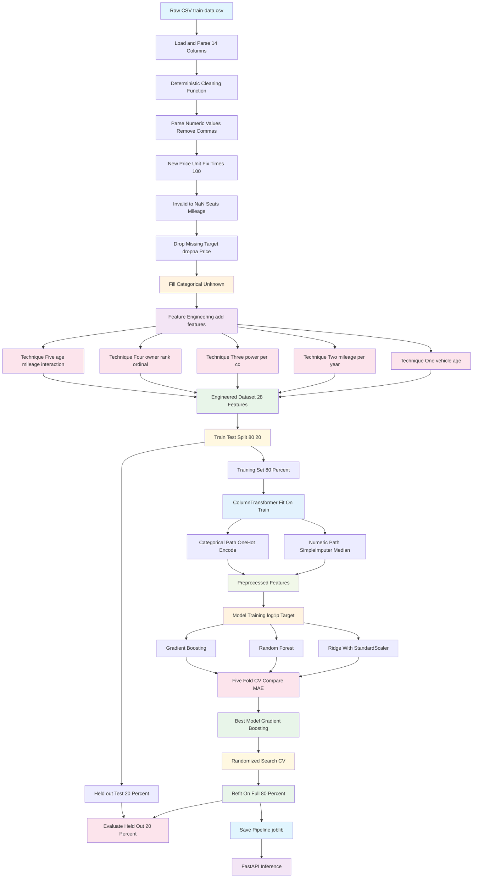

# Data Preprocessing and Feature Engineering Pipeline

## Key Stages Summary

| Stage | Description | Leakage Prevention |
|-------|-------------|-------------------|
| **1. Raw Load** | Read CSV, assign 14 canonical columns | - |
| **2. Deterministic Cleaning** | Parse numbers, fix units, invalid to NaN, drop missing target, fill categoricals | No fitted statistics |
| **3. Feature Engineering** | 5 derived features (vehicle_age, mileage_per_year, power_per_cc, owner_rank, age_mileage_interaction) | Pure row-wise math, no data fitting |
| **4. Train/Test Split** | 80/20 split BEFORE any statistical fitting | Held-out set untouched until final eval |
| **5. Preprocessing Pipeline** | Median imputation (numeric), most-frequent plus one-hot (categorical) | Imputer/encoder fit ONLY on 80% training fold |
| **6. Model Training** | Ridge, RandomForest, GradientBoosting on log1p(Price) | 5-fold CV on training fold only |
| **7. Hyperparameter Tuning** | RandomizedSearchCV on best candidate | CV inside training fold only |
| **8. Final Evaluation** | Single evaluation on held-out 20% | Test set never used during fitting |
| **9. Serialization** | joblib pipeline plus metadata for FastAPI | Feature engineering applied before pipeline at inference |